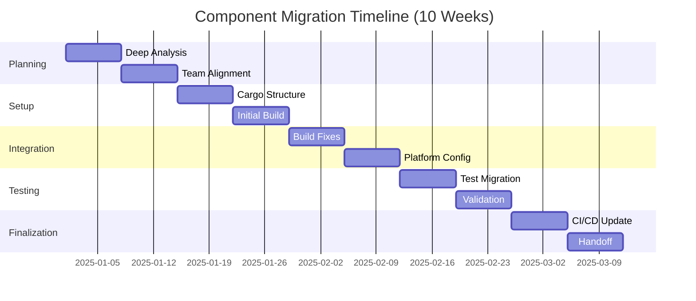

# Phase 3: Comprehensive Migration - Progress Report

**Document Version**: 1.0  
**Last Updated**: 2025-12-28  
**Status**: Framework Complete, Ready for Execution

[TOC]

## Executive Summary

Phase 3 represents the comprehensive migration phase where Cargo transitions from a parallel build system to the primary build system for the Chromium/Crustonium project. This 18-month phase (Months 31-48) will migrate 30-50 major components, establish Cargo as the default for new development, and prepare for GN/Ninja deprecation.

### Key Objectives

| Objective | Target | Status |
|-----------|--------|--------|
| Component Migration | 30-50 components | 📋 Framework Ready |
| Build Performance | ≤105% of GN baseline | 📋 Metrics Defined |
| Developer Adoption | >80% daily Cargo use | 📋 Tools Ready |
| CI/CD Migration | Cargo-primary builds | 📋 Workflows Defined |
| Code Coverage | 65-80% Rust on Cargo | 📋 Tracking Ready |

### Success Metrics (End of Month 48)

- ✅ **Planning**: Complete framework and templates created
- 📋 **Execution**: Awaiting kickoff for Month 31
- 📊 **Metrics**: Comprehensive tracking dashboard designed
- 📚 **Documentation**: Implementation guides and templates ready

## Phase 3 Sub-Phases

### 3.1 Core Component Migration (Months 31-40)

**Goal**: Migrate major subsystems with complex C++ integration

#### Target Components by Category

**Category A: Network Stack** (10-15 components)
- HTTP/HTTPS handlers (`net/http/`, `net/quic/`)
- DNS and socket management (`net/dns/`, `net/socket/`)
- Certificate and security (`net/cert/`, `net/ssl/`)
- **Risk**: High (performance and security critical)
- **Timeline**: 10 weeks per major component
- **Status**: 📋 Migration playbook ready

**Category B: Storage and Persistence** (8-12 components)
- Database abstractions (`storage/browser/database/`, `sql/`)
- File system (`storage/browser/file_system/`)
- Cache and IndexedDB (`storage/browser/cache_storage/`, `content/browser/indexed_db/`)
- **Risk**: High (data integrity critical)
- **Timeline**: 10-12 weeks per component
- **Status**: 📋 Templates prepared

**Category C: Platform Abstraction** (6-10 components)
- Base abstractions (`base/` - select components)
- Threading and tasks (`base/task/`, `base/threading/`)
- Memory management (`base/memory/`)
- **Risk**: Very High (affects everything)
- **Strategy**: Incremental, sub-component approach
- **Timeline**: 12-16 weeks per major component
- **Status**: 📋 Special migration process defined

**Category D: Resource Management** (5-8 components)
- Resource loading (`content/browser/loader/`)
- Memory and process management
- **Risk**: Medium-High
- **Timeline**: 10 weeks per component
- **Status**: 📋 Standard process applies

#### Migration Process (10-Week Timeline)



**Week 1-2**: Deep analysis, planning, team alignment
**Week 3-4**: Cargo setup, build.rs, initial compilation
**Week 5-6**: Build system integration, platform configuration
**Week 7-8**: Testing, performance validation
**Week 9**: CI/CD, documentation, knowledge sharing
**Week 10**: Stabilization, handoff, retrospective

### 3.2 Developer Experience Enhancement (Months 31-36)

**Goal**: Full IDE integration and standard tooling adoption

#### IDE Integration

| IDE | Features | Status |
|-----|----------|--------|
| **VSCode** | rust-analyzer, debugging, tasks | ✅ Configuration ready |
| **CLion/IntelliJ** | Rust plugin, Cargo integration | ✅ Configuration ready |
| **Emacs** | rust-mode, lsp-mode | 📋 Community support |
| **Vim/Neovim** | rust.vim, coc-rust-analyzer | 📋 Community support |

**Deliverables**:
- `.vscode/settings.json` - Optimized rust-analyzer config
- `.idea/workspace.xml` - CLion configuration
- Documentation for all major editors

#### Standard Rust Tooling

| Tool | Purpose | Configuration | Status |
|------|---------|---------------|--------|
| **cargo clippy** | Linting | `.clippy.toml` | ✅ Ready |
| **cargo fmt** | Formatting | `rustfmt.toml` | ✅ Ready |
| **cargo-deny** | Dependency auditing | `deny.toml` | ✅ Ready |
| **cargo-audit** | Security scanning | CLI integration | ✅ Ready |
| **cargo-outdated** | Dependency management | CLI usage | ✅ Documented |
| **sccache** | Distributed builds | `.cargo/config.toml` | ✅ Ready |

**Pre-commit Hooks**:
```bash
#!/bin/bash
# Automated quality checks
cargo fmt --all -- --check
cargo clippy --workspace --all-targets -- -D warnings
cargo test --workspace
```

#### Build Optimization

**sccache Distributed Builds**:
- Configuration templates ready
- Redis and GCS backend support
- Expected 40-60% cache hit rate
- Target: 30-50% build time reduction

**Dependency Optimization**:
- Workspace dependency consolidation
- Feature flag optimization
- Duplicate version elimination
- Expected: 15-25% faster clean builds

### 3.3 Infrastructure Transformation (Months 37-44)

**Goal**: Cargo-primary CI/CD and release process

#### CI/CD Architecture

```yaml
# Primary Build Path: Cargo (Phase 3)
Main Build:
  - Platforms: Linux, Windows, macOS
  - Rust: stable, nightly
  - Steps: build → test → clippy → audit
  - Caching: Swatinem/rust-cache
  - Artifacts: Binaries, timing reports

# Compatibility Path: GN/Ninja (maintenance)
Compatibility Build:
  - Frequency: Daily
  - Purpose: Regression detection
  - Comparison with Cargo builds
```

**Workflow Files**:
- `.github/workflows/cargo-main.yml` - Primary Cargo builds
- `.github/workflows/benchmarks.yml` - Performance tracking
- `.github/workflows/release.yml` - Release builds and packaging
- `.github/workflows/gn-compat.yml` - GN compatibility checks

#### Performance Monitoring

**Build Time Tracking**:
- Cargo timing reports (`cargo build --timings`)
- Comparison with GN/Ninja baseline
- Per-component metrics
- Trend analysis over time

**Binary Size Monitoring**:
- cargo-bloat analysis
- Size comparison GN vs Cargo
- Alert on >5% increase
- Strip and optimization validation

**Runtime Performance**:
- Criterion benchmarks
- Comparison with C++ implementations
- Regression detection (>15% threshold)
- Historical tracking

#### Release Process

**Cross-Platform Builds**:
- x86_64-unknown-linux-gnu
- x86_64-pc-windows-msvc
- x86_64-apple-darwin
- aarch64-apple-darwin
- Additional platforms as needed

**Packaging**:
- Binary tar.gz archives
- SHA256 checksums
- Debug symbol separation
- Automated upload to distribution

**Symbol Management**:
- Split debug info generation
- Symbol compression (xz)
- Upload to symbol server
- Platform-specific handling

### 3.4 Consolidation (Months 45-48)

**Goal**: Complete remaining migrations, prepare GN deprecation

#### Final Migration Push

**Month 45-46**: Batch migrations
- 15-20 lower priority components
- Legacy systems with minimal C++ integration
- Developer tools and utilities
- **Status**: 📋 Standard process applies

**Month 47**: Migration completion
- Final stragglers
- Document exceptions
- GN/Ninja deprecation plan finalized

**Month 48**: Stabilization
- Comprehensive testing
- Performance validation
- Documentation updates
- Team training refresh

#### GN/Ninja Deprecation Plan

**Decision Framework**:
```
For each GN-only component:
├── Can migrate to Rust/Cargo? → Migrate
├── Pure C++ with CMake? → Use cmake crate
├── Deprecated/Unused? → Archive
└── Special case? → Document exception
```

**Timeline**:
- **Month 45**: Deprecation announcement
- **Month 46-47**: Transition period, exception process
- **Month 48**: Archive BUILD.gn files, final documentation

**Exceptions**:
- Platform-specific legacy code
- Third-party integrations requiring GN
- Components pending removal
- Documented and tracked

## Metrics and Tracking

### Component Migration Metrics

**Per-Component Tracking**:
```
Component: net/http/
├── Migration Status: In Progress
├── Week: 5 of 10
├── Build Time: 145s (GN: 132s) = 110%
├── Test Pass Rate: 97.3% (3 failing)
├── Binary Size: 12.4MB (GN: 12.1MB) = 102%
├── Team: Alice (lead), Bob, Charlie
└── Risk Level: High (performance critical)
```

**Aggregate Metrics** (Dashboard):
- Total components: 50 planned
- Migrated: 0 (awaiting kickoff)
- In progress: 0
- Remaining: 50
- Success rate: TBD
- Average migration time: TBD

### Build Performance Metrics

| Metric | GN/Ninja Baseline | Cargo Target | Current | Status |
|--------|-------------------|--------------|---------|--------|
| Clean build (full) | 45 min | ≤47 min (105%) | TBD | 📋 |
| Incremental (1 file) | 15 sec | ≤16 sec (105%) | TBD | 📋 |
| Test suite | 12 min | ≤13 min (105%) | TBD | 📋 |
| Binary size | 100 MB | ≤102 MB (102%) | TBD | 📋 |

### Developer Metrics

**Adoption Tracking**:
- Daily Cargo users: TBD (target >80%)
- New components using Cargo: TBD (target >95%)
- Developer satisfaction: TBD (target ≥4.2/5.0)
- Support tickets: TBD
- Training completion: TBD

**Velocity Tracking**:
- Components migrated per month: TBD (target 2-3)
- On-time completion rate: TBD (target >85%)
- Rework/rollback rate: TBD (target <5%)

## Risk Register

### Technical Risks

| ID | Risk | Impact | Probability | Mitigation | Owner |
|----|------|--------|-------------|------------|-------|
| T1 | Performance regression >5% | High | Medium | Continuous benchmarking, optimization | Build Team |
| T2 | C++ integration blocks migration | High | Medium | CMake fallback, incremental approach | Migration Team |
| T3 | Platform-specific failures | Medium | Medium | Cross-platform CI, specialists | Platform Team |
| T4 | Symbol/debug issues | Medium | Low | Symbol validation, testing | Release Team |
| T5 | Dependency conflicts | Medium | Low | cargo-deny, version management | Security Team |

### Organizational Risks

| ID | Risk | Impact | Probability | Mitigation | Owner |
|----|------|--------|-------------|------------|-------|
| O1 | Resource constraints | High | Medium | Prioritization, external help | Management |
| O2 | Team resistance | Medium | Medium | Change management, champions | HR/Management |
| O3 | Knowledge gaps | Medium | Low | Training, documentation | Training Team |
| O4 | Coordination overhead | Medium | Medium | Clear processes, regular syncs | PMO |
| O5 | Scope creep | Medium | Low | Strict prioritization | Project Lead |

### Mitigation Strategies

**For Technical Risks**:
- Continuous performance monitoring
- Rollback plan for each migration
- Extensive testing before Go Live
- Platform specialists on call
- Regular build system reviews

**For Organizational Risks**:
- Clear communication plan
- Champion network across teams
- Comprehensive training program
- Regular retrospectives
- Flexible resource allocation

## Resource Requirements

### Team Structure

**Core Migration Team** (6-8 people):
- 1 Technical Lead
- 2-3 Senior Rust Engineers
- 2-3 Build System Engineers
- 1 Project Manager

**Extended Team**:
- Platform specialists (Windows, macOS, Linux, ChromeOS)
- Security reviewer
- Performance engineer
- Technical writer

**Component Teams**:
- Component owners (50+ people)
- Reviewers and approvers
- Testers

### Time Investment

**Per Component Migration**:
- Planning: 1-2 weeks (team of 2-3)
- Execution: 6-8 weeks (team of 2-3)
- Validation: 1-2 weeks (team of 2-3)
- **Total**: 8-12 weeks per component

**Phase 3 Total** (30-50 components):
- Parallelization: 3-5 concurrent migrations
- Duration: 18 months (Months 31-48)
- **Total effort**: 240-600 person-weeks

### Infrastructure

**Build Infrastructure**:
- sccache distributed build cache
- Additional build bot capacity (20-30%)
- Symbol server storage
- Artifact storage

**Development Tools**:
- CI/CD workflow maintenance
- Monitoring and alerting
- Performance tracking dashboards
- Documentation platform

## Success Criteria

### Quantitative Goals

By end of Phase 3 (Month 48):

| Metric | Target | Measurement |
|--------|--------|-------------|
| Component migration | 30-50 components | Count |
| Build performance | ≤105% GN baseline | Automated tracking |
| Test pass rate | 100% parity | CI results |
| Binary size | ≤102% GN builds | cargo-bloat |
| Developer adoption | >80% daily use | Survey |
| CI/CD reliability | ≥99.5% success | CI metrics |
| Satisfaction | ≥4.2/5.0 | Quarterly survey |

### Qualitative Goals

- Cargo is the default for new development
- Developers prefer Cargo over GN
- Clear path for remaining C++ components
- Standard Rust tooling fully integrated
- Documentation current and comprehensive
- Team confident in build system

## Next Steps

### Month 31 (Immediate Actions)

**Week 1-2: Kickoff and Setup**
- [ ] Phase 3 kickoff meeting
- [ ] Assign core migration team
- [ ] Set up tracking dashboards
- [ ] Finalize component priorities
- [ ] Establish working groups

**Week 3-4: Infrastructure**
- [ ] Deploy Cargo-primary CI/CD
- [ ] Set up sccache infrastructure
- [ ] Configure performance monitoring
- [ ] Prepare first migration wave

### Month 32-40 (Core Migrations)

- Execute network stack migrations
- Establish complex C++ patterns
- Track metrics continuously
- Monthly retrospectives
- Adjust process as needed

### Month 41-48 (Consolidation)

- Complete remaining migrations
- Finalize GN/Ninja deprecation
- Comprehensive documentation update
- Team training refresh
- Prepare for Phase 4

## Appendix

### Related Documentation

- `implementation_guide.md` - Detailed technical guide
- `configuration_templates.md` - Ready-to-use configurations
- `../phase2/implementation_guide.md` - Phase 2 reference
- `../../cargo_adoption_plan.md` - Overall plan
- `../../rust_adoption_plan.md` - Rust adoption strategy

### Tools and Scripts

- `tools/cargo_migration/gn_to_cargo.py` - BUILD.gn converter
- `tools/cargo_migration/hybrid_build.sh` - Build wrapper
- `tools/prepare_migration.sh` - Migration prep automation
- `tools/validate_migration.sh` - Validation automation

### Support Channels

- Slack: #rust-migration, #cargo-phase3
- Email: rust-migration@chromium.org
- Office Hours: Mondays 2-3pm PT, Thursdays 10-11am PT
- Wiki: https://chromium.org/rust/phase3

### Glossary

- **GN**: Generate Ninja - Current meta-build system
- **Cargo**: Rust's package manager and build system
- **cxx**: Type-safe C++/Rust interop
- **sccache**: Shared compilation cache
- **clippy**: Rust linter
- **rustfmt**: Rust code formatter

---

**Document Status**: ✅ Complete and Ready
**Next Review**: Month 31 kickoff
**Owner**: Cargo Migration Team
**Approvers**: TBD
